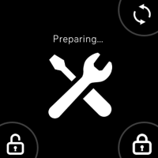
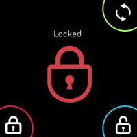

# README
sesame-app is an application for fitbit versa that to lock and unlock your door with Sesame, smart-lock device.
Please open Fitbit Application on iPhone, set this app configuration.

## Fitbit Versa screenshots
    

## Usage
This app is not published to the app store.
You will need to deploy by using Fitbit Studio and replace Sesame token and Device ID.

## How to replace your Sesame auth token and a device ID
1. Create Sesame auth token, please see [this page](https://docs.candyhouse.co/#authentication).
2. Enable cloud integration for your Sesame Application on smartphone.  
   [Status] > [Change Settings] > [Integration], please see [this page](https://docs.candyhouse.co/#before-you-start). 
2. Get a sesame device ID using "Get sesame list" API, please see [API spec](https://docs.candyhouse.co/#get-sesame-list).
3. Open `./companion/sesame.js`
4. Replace following parameters: 
   * `{YOUR-SESAME-AUTH-TOKEN}`: Sesame auth token
   * `{YOUR-SESAME-DEVICE-ID}`: Sesame device ID

## Hot to deploy
Please see [Fitbit Developer - Getting Started](https://dev.fitbit.com/getting-started/)

## Licence
The MIT License.

Copyright (c) 2019 chick-p

Permission is hereby granted, free of charge, to any person obtaining a copy of this software and associated documentation files (the "Software"), to deal in the Software without restriction, including without limitation the rights to use, copy, modify, merge, publish, distribute, sublicense, and/or sell copies of the Software, and to permit persons to whom the Software is furnished to do so, subject to the following conditions:

The above copyright notice and this permission notice shall be included in all copies or substantial portions of the Software.

THE SOFTWARE IS PROVIDED "AS IS", WITHOUT WARRANTY OF ANY KIND, EXPRESS OR IMPLIED, INCLUDING BUT NOT LIMITED TO THE WARRANTIES OF MERCHANTABILITY, FITNESS FOR A PARTICULAR PURPOSE AND NONINFRINGEMENT. IN NO EVENT SHALL THE AUTHORS OR COPYRIGHT HOLDERS BE LIABLE FOR ANY CLAIM, DAMAGES OR OTHER LIABILITY, WHETHER IN AN ACTION OF CONTRACT, TORT OR OTHERWISE, ARISING FROM, OUT OF OR IN CONNECTION WITH THE SOFTWARE OR THE USE OR OTHER DEALINGS IN THE SOFTWARE.
